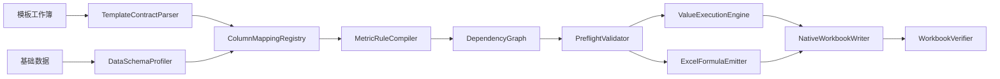

# 无公式通报模板映射与计算技术设计

Feature Name: formula-driven-notice-mapping
Updated: 2026-08-19

## 1. Design Summary

本方案将无公式通报生成拆成四层：模板结构契约、维度映射、指标规则、执行与校验。每个模板版本保存一份独立 profile 和 mapping snapshot。通报页列作为主键，基础数据字段作为来源，指标规则负责聚合和派生计算，执行器根据计算引擎写入结果值或 Excel 公式。

方案采用“值计算优先、公式输出可选”的双引擎策略：值计算确保 Linux 和 Windows 均能产生可验证结果，公式输出保留 Excel 内可复核的计算链路。两种引擎共享同一份规则 AST、依赖图和校验结果。

## 2. Sample Workbook Interpretation

```text
模版!A3  <- 明细!A[DAY_ID] 的报告日期
模版!B3  <- 日期参数的日号
模版!B5:B20 <- 模板内置组织全称
模版!C5:C20 <- 模板内置组织简称
模版!D5:D20 <- 模板内置目标值
模版!E5:E20 <- 指标 metric.total_daily
模版!F5:F20 <- metric.total_daily / target
模版!G5:G20 <- 指标 metric.original_quantity
模版!H5:H20 <- 指标 metric.final_quantity
模版!I5:I20 <- 指标 metric.sequential_completion
模版!J5:J20 <- rank(metric.rank_input)
模版!K5:K20 <- 指标 metric.product_daily
模版!L5:L20 <- 指标 metric.product_monthly
模版!E21:L21 <- 对应列的合计或整体指标
```

该映射是初始化候选。用户确认组织字段、周期字段、产品条件和指标口径后，系统才生成可运行 snapshot。

带公式模板的初始化流程优先提取原始公式语义。系统读取首个组织行的 `E:L` 公式，识别来源列、组织列、日期列、产品筛选、比率分母、排名来源和排名范围。提取结果作为可编辑草稿，`AZ` 等公式中没有出现的字段保持未启用状态。

## 3. Architecture



## 4. Components

### 4.1 TemplateContractParser

输入工作簿，输出：

- Sheet 角色和可见状态。
- 通报列地址、表头、区域、样式签名和覆盖权限。
- 明细字段地址、表头行、数据起始行和动态范围。
- 模板内置维度值与目标值。
- 已存在公式和公式覆盖保护信息。

### 4.2 ColumnMappingRegistry

以 `template_version + sheet + target_address` 为唯一键保存列映射。映射类型：

- `template_value`：保留模板原值，例如单位名称和目标值。
- `field`：直接读取明细字段。
- `metric`：调用指标规则聚合。
- `formula`：由规则表达式计算。
- `constant`：写入显式常量。
- `empty`：明确允许为空的展示列。

### 4.3 MetricRuleCompiler

将指标规则编译为统一 AST：

```json
{
  "name": "product_daily",
  "result_type": "number",
  "aggregate": "sum",
  "source_field": "百元等效值",
  "group_by": ["组织"],
  "filters": [
    {"field": "业务类型", "operator": "equals", "value": "升档专用合约"}
  ],
  "date": {"field": "DAY_ID", "scope": "day"},
  "empty_policy": "zero",
  "precision": 3
}
```

编译器负责字段存在性、类型、条件操作符、依赖和循环校验，并输出值计算计划与 Excel 公式计划。

### 4.4 DimensionResolver

为通报行建立维度上下文：

```json
{
  "template_row": 5,
  "display_name": "南阳市邓州市分公司",
  "short_name": "邓州",
  "source_field": "收入归属区县名称",
  "source_values": ["南阳市邓州市分公司"],
  "target": 614
}
```

支持全称、简称、别名和多值映射。默认候选使用 `BA`（`下沉区县名称`），因为样例 `BA` 的值与模板单位全称具备直接语义匹配；`H`（`收入归属区县名称`）和 `AG`（`受理渠道区县名称`）作为可选组织维度候选。`AZ`（`下沉规则`）作为与 `BA` 配套的条件字段候选，当前样本值包含“发展人”。

### 4.5 ValueExecutionEngine

按依赖拓扑计算：

1. 读取数据源并规范化日期、数字和文本。
2. 为每个模板单位解析明细匹配行。
3. 执行基础聚合指标。
4. 执行比率、序时完成率和排名等派生指标。
5. 执行合计行规则。
6. 输出结果值、计算日志、匹配行数和异常。

### 4.6 ExcelFormulaEmitter

将同一 AST 转换为 Excel 公式。公式生成器使用动态明细范围或 Excel Table 列引用，避免依赖固定 3449 行。公式中使用已确认的字段列地址、组织值、日期边界和产品条件，并将公式写入公式允许覆盖区。

### 4.7 WorkbookVerifier

生成后检查：

- Sheet 名称、顺序和数量。
- 通报列映射覆盖范围。
- 公式引用的 Sheet、列和命名区域存在性。
- 数值列、百分比列、排名列结果类型。
- 合计行和组织行数量。
- 合并区域、样式签名和明细数据起始行。

## 5. Data Models

### 5.1 NoticeColumnMapping

```text
id
template_id
sheet_name
mapping_kind
source_field
metric_rule_id
expression
constant_value
write_mode
format_kind
required
confirmed_by_user
rule_version
```

### 5.2 MetricRule

```text
id
workflow_id
name
label
result_type
aggregate
source_field
filters
numerator_rule_id
rank_config
empty_policy
precision
execution_mode
status
version
```

### 5.3 DimensionBinding

```text
id
workflow_id
source_field
match_kind
alias_map
template_value
source_values
confirmed_by_user
```

### 5.4 MappingSnapshot

沿用现有 `MappingSnapshot`，扩展保存：

- `column_mappings`
- `metric_rules`
- `dimension_bindings`
- `formula_plan`
- `preflight_result`
- `execution_mode`

## 6. API

```text
POST /api/templates/{template_id}/analyze-workbook
GET  /api/templates/{template_id}/mapping-schema
GET  /api/workflows/{workflow_id}/notice-mappings
PUT  /api/workflows/{workflow_id}/notice-mappings
POST /api/workflows/{workflow_id}/metric-rules
PUT  /api/workflows/{workflow_id}/metric-rules/{rule_id}
POST /api/workflows/{workflow_id}/notice-mappings/preview
POST /api/workflows/{workflow_id}/notice-mappings/validate
POST /api/workflows/{workflow_id}/notice-mappings/publish
GET  /api/tasks/{task_id}/calculation-trace
```

`publish` 生成不可变 mapping snapshot。`tasks/run` 只接受已发布 snapshot，保存值计算或公式输出的执行模式。

## 7. Formula Strategy

### 7.1 默认策略

- 规则开发和预检阶段使用值计算引擎，便于逐行核对。
- 生产成品默认写入值，确保任务状态可直接验证。
- 用户启用“保留可重算公式”后，写入公式并标记 Excel 重算状态。
- 公式输出同时保存计算计划和预期值，用于 Windows Excel 重算后的差异校验。

### 7.2 公式安全边界

- 只允许白名单函数和比较操作符。
- 禁止外部工作簿引用、宏、动态执行和未授权名称。
- 公式只能写入已确认的公式映射列。
- 公式生成不覆盖模板保留值列、合并单元格非左上角和锁定列。

## 8. Correctness Properties

1. 每个可写通报列恰好绑定一个映射规则。
2. 每个指标规则的来源字段和过滤字段都存在于数据源契约。
3. 每个派生指标的依赖图保持无环并按拓扑顺序执行。
4. 组织行匹配使用确认后的维度绑定，不使用未经确认的相似字段。
5. 值计算结果与公式计划在相同输入下具有一致的业务语义。
6. 合计行使用显式规则，避免将百分比列简单求和。
7. 模板原生结构校验通过后才允许导出成品。

## 9. Error Handling

- 字段缺失：指出目标列、规则名称和缺失字段。
- 维度冲突：显示模板值、候选字段和值及冲突行数。
- 日期无法解析：显示原始样例和转换失败数量。
- 除数为 0：按指标规则返回空值或 0，并记录警告。
- 公式不可发射：回退值计算前要求用户确认执行模式。
- 公式引用错误：阻止发布 snapshot。
- 结果差异：保存值计算结果、公式文本和重算结果差异明细。

## 10. Test Strategy

### Unit Tests

- 解析无公式样例的通报列和明细字段。
- 验证 BA、H、AG 作为组织候选时的语义匹配提示，并验证 AZ 作为下沉规则条件字段。
- 验证 `sum`、`count`、比率、排名和合计规则。
- 验证空值、零分母、日期边界和产品条件。
- 验证公式 AST 到值计划、Excel 公式计划的双向样例。

### Integration Tests

- 使用样例数据生成带值的通报页。
- 使用同一 snapshot 生成公式版通报页。
- 比较值版和公式版的预期值。
- 检查 `模版` 与 `明细` Sheet、样式、合并区域和明细行保持不变。
- 检查缺失字段、未确认映射和维度冲突能够阻止任务提交。

### Windows Tests

- 使用 Excel 打开公式版并执行重算。
- 比较 Excel 重算结果与值计算快照。
- 检查打印区域、分页、百分比格式和排名显示。
