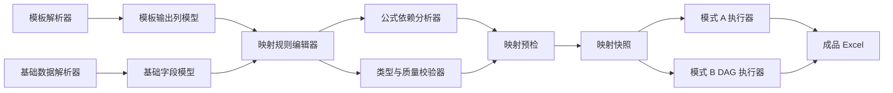

# 模板与基础数据映射中心技术方案

Feature Name: template-data-mapping-center
Updated: 2026-08-18

## 1. 方案目标

建立一套以模板输出列为中心的映射模型，将模板结构、基础数据字段、公式依赖、条件过滤、转换规则和生成前校验统一起来。现有模式 A 和模式 B 继续作为执行方式，映射中心负责提供统一的可视化配置、校验和快照。

## 2. 核心架构



## 3. 设计原则

- 模板输出列是映射主键，避免用户在大量基础字段中猜测输出位置。
- 模板结构与映射规则分离，映射保存不会修改模板样式资产。
- 原生模板公式与工作流公式明确分层，原生公式优先保留。
- 模式 A 和模式 B 产生统一的映射快照，保证结果审计字段一致。
- 生成队列只接受预检通过的映射快照。

## 4. 数据模型

### 4.1 TemplateColumn

```text
template_id
template_version
sheet_name
column_address
header
value_type
is_formula
formula_text
formula_references
is_hidden
merged_range
style_signature
required
```

`style_signature` 只用于展示和校验模板资产稳定性，映射服务不修改样式内容。

### 4.2 DataField

```text
data_source_id
field_name
value_type
nullable
non_empty_rate
sample_values
field_signature
```

字段签名由字段名称和规范化类型集合生成，字段顺序变化不影响签名。

### 4.3 MappingRule

```text
id
workflow_id
template_id
template_version
sheet_name
target_column
target_header
source_kind
source_field
expression
dependencies
constant_value
transform_kind
default_value
condition
validation_status
validation_messages
recommendation_status
confirmed_by_user
rule_version
```

`source_kind` 枚举：

- `field`
- `formula`
- `constant`
- `conditional`
- `template_formula`
- `empty`

### 4.4 MappingSnapshot

```text
workflow_id
workflow_version
template_id
template_version
data_source_id
data_field_signature
mapping_rule_version
rules
dependency_order
validation_result
created_at
```

任务记录保存 `snapshot_id` 或完整快照 JSON，成品“工作流配置”Sheet 保存可读版规则。

## 5. 映射规则处理

### 5.1 模板解析

复用现有模板解析服务，扩展返回：

- Sheet 和列地址
- 表头和目标数据类型
- 原生公式及引用关系
- 隐藏状态、合并范围和样式摘要
- 必填列判定

模板公式列默认生成 `template_formula` 规则，并进入锁定状态。

### 5.2 基础字段解析

复用现有数据读取和质量报告服务，统一输出字段名称、推断类型、空值率、示例值和字段签名。类型兼容规则至少覆盖：

- `text -> text`
- `integer -> number`
- `float -> number`
- `date/datetime -> date`
- `boolean -> boolean`

文本到数字、日期文本到日期等转换需要显式 `transform_kind`，转换失败进入数据质量错误。

### 5.3 自动推荐

推荐顺序：

1. 完全匹配字段名。
2. 去除空格、下划线、大小写和常见中文标点后的规范化匹配。
3. 表头与字段名的包含关系匹配。
4. 类型兼容性加权。

推荐结果必须携带 `score`、`reason`、`type_compatible` 和 `candidate_fields`，用户确认后才进入可运行规则。

### 5.4 公式依赖

公式分析器解析表达式 AST，提取字段名并构建依赖图。系统执行以下校验：

- 字段存在性
- AST 节点和操作符白名单
- 循环依赖
- 依赖字段类型
- 结果类型与模板目标列类型

计算顺序使用拓扑排序，映射快照保存排序结果。

### 5.5 模式 B 统一映射

模式 B 节点仍保存 DAG 配置，映射中心生成只读的统一视图：

- `data_source` 节点提供基础字段集合。
- `field_mapping` 和 `write_template` 节点生成目标列规则。
- `formula` 节点生成公式规则。
- `condition` 节点生成条件规则并关联影响范围。
- `output_file` 节点提供输出边界。

执行器继续使用 DAG 原始配置，统一视图用于配置、预检和审计。

## 6. API 设计

建议新增接口：

```text
GET  /api/templates/{template_id}/mapping-schema
GET  /api/data-sources/{source_id}/mapping-fields
POST /api/mapping/preview
POST /api/mapping/validate
POST /api/workflows/{workflow_id}/mapping-rules
GET  /api/workflows/{workflow_id}/mapping-rules
GET  /api/workflows/{workflow_id}/mapping-snapshots
POST /api/workflows/{workflow_id}/mapping-snapshots
```

`POST /api/mapping/preview` 接收模板 ID、数据源 ID、工作流模式和临时规则，返回推荐结果、依赖图、类型检查和错误列表。生成接口只接收已保存且预检通过的快照引用。

## 7. 前端交互设计

页面采用三栏结构：

- 左栏：模板 Sheet 和输出列树。
- 中栏：当前输出列的映射规则编辑器。
- 右栏：基础字段搜索列表、字段类型、示例值和质量状态。

顶部固定显示：

- 模板名称和版本
- 基础数据名称和字段签名
- 映射完成度
- 错误、警告和待确认数量
- 保存和预检按钮

输出列状态：

- 绿色：已确认且校验通过
- 黄色：存在警告或自动推荐待确认
- 红色：缺失字段、类型冲突或公式错误
- 灰色：模板公式锁定或非数据列

用户点击公式列时，右侧展示公式文本、引用单元格和依赖字段。用户点击条件节点生成的列时，展示条件字段、比较方式、比较值和影响范围。

## 8. 生成链路改造

1. 导入模板后建立模板结构缓存。
2. 导入基础数据后建立字段结构和质量摘要。
3. 根据模板输出列生成推荐规则。
4. 用户确认规则并执行映射预检。
5. 保存映射规则版本和快照。
6. 任务提交时传递快照引用。
7. 任务执行器加载快照，向模式 A 或模式 B 适配器提供统一依赖信息。
8. 结果配置 Sheet 写入模板版本、数据源签名、每列来源、公式依赖和预检结果。

## 9. 正确性属性

1. 映射完整性：每个必需模板输出列存在且最多一个主规则。
2. 来源可追溯性：每个非模板公式输出列可追溯到字段、常量、表达式或条件。
3. 依赖闭包：公式和条件依赖字段全部存在于当前数据源或前置计算字段。
4. 类型一致性：写入值经过转换后与模板目标列类型兼容。
5. 快照稳定性：任务生成后映射快照不随工作流后续修改而变化。
6. 模板保护：映射保存和预检不会改变模板样式、列宽、行高、合并和原生公式。
7. 模式一致性：模式 A 和模式 B 的统一映射视图使用相同目标列、来源字段和依赖字段命名。

## 10. 错误处理

- 模板没有可映射输出列：提示模板结构不完整并阻止创建工作流。
- 基础数据没有字段：展示字段解析失败和重新导入入口。
- 必需字段缺失：定位到对应模板 Sheet 和列。
- 类型不兼容：展示源类型、目标类型和可用转换。
- 公式语法错误：展示表达式位置和错误原因。
- 公式循环依赖：展示依赖环路并阻止保存。
- 模板版本变化：将旧规则标记为待复核，禁止静默套用。
- 快照不存在或已失效：任务提交失败并要求重新执行映射预检。

## 11. 测试策略

- 模板解析测试：多 Sheet、公式列、隐藏列、合并单元格和样式摘要。
- 字段推荐测试：精确匹配、规范化匹配、模糊匹配、类型冲突和字段顺序变化。
- 映射校验测试：缺失字段、重复目标列、常量、转换和空值策略。
- 公式测试：依赖提取、非法表达式、循环依赖、类型冲突和拓扑顺序。
- 模式一致性测试：模式 A 和模式 B 生成同一统一映射视图。
- 快照测试：工作流修改后历史任务仍读取原快照。
- 结果测试：工作流配置 Sheet 包含每个目标列来源、公式依赖和校验结果。
- 回归测试：现有 36 个后端测试、模板样式保留测试、批量生成和 Windows 资源路径测试。

## 12. 实施顺序

1. 扩展模板解析输出和基础字段输出。
2. 建立统一 MappingRule 和 MappingSnapshot schema。
3. 实现推荐、依赖分析和类型校验服务。
4. 为模式 A 增加规则适配器。
5. 为模式 B 增加 DAG 到统一映射视图适配器。
6. 实现映射中心前端页面。
7. 改造生成前预检和任务快照。
8. 补充结果配置 Sheet 和完整回归测试。
