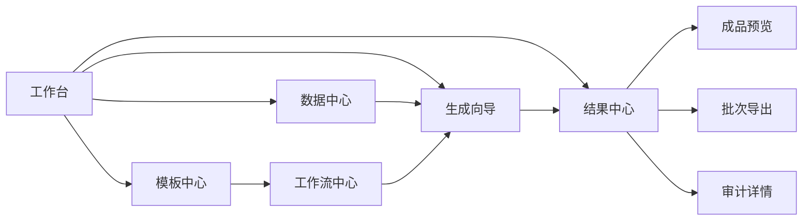

# Excel Workflow 界面与工作流体验优化设计

Feature Name: ui-workflow-experience-overhaul
Updated: 2026-08-18

## 1. 设计目标

将现有分散能力组织成三层信息架构：

- 工作台：回答“现在有什么、哪里需要处理、下一步做什么”。
- 资产中心：管理模板、数据源和工作流。
- 运行中心：完成生成向导、批次管理、成品预览、导出和审计。

设计沿用 React + Ant Design + FastAPI + SQLite 的现有架构，优先通过页面状态、路由语义、共享数据加载和结果组件完成优化。

## 2. 信息架构



### 2.1 工作台

工作台由四个区域组成：

1. 主操作区：开始生成、导入数据、查看结果。
2. 资产概览区：模板、数据源、工作流、成功任务数量。
3. 待处理区：质量问题、失败任务、未完成配置。
4. 最近活动区：最近批次、最近成品、最近审计事件。

### 2.2 模板中心

模板列表统一展示模板版本、公式、Sheet、适用字段和示例标记。模板详情采用 Tabs：

- 概览：模板信息、版本和适用字段。
- Sheet 预览：前 N 行和列结构。
- 公式：公式校验、缓存错误和依赖。
- 工作流：绑定或推荐工作流。
- 教程：示例操作路径。

### 2.3 数据中心

数据源详情采用“概览 + 质量 + 匹配 + 字段”结构：

- 概览：文件、行数、字段数、指纹、创建时间。
- 质量：问题数量、字段统计、问题明细、报告下载。
- 匹配：候选工作流、匹配分数、缺失字段、创建专属工作流。
- 字段：字段名称、类型、空值状态和签名。

### 2.4 工作流中心

工作流列表支持模式、模板版本、适用字段、示例和最近使用筛选。详情根据模式进入：

- 模式 A：字段映射、公式列、模板版本和校验结果。
- 模式 B：DAG 画布、节点配置、数据源节点、验证结果和保存状态。

### 2.5 生成向导

生成向导使用受控步骤状态：

```text
数据源 -> 工作流 -> 质量预检 -> 通报配置 -> 生成 -> 成品结果
```

每一步保存到前端的 `WorkflowRunDraft`，数据源、工作流和通报配置通过后端任务请求固化。步骤切换由当前状态和校验结果决定。

### 2.6 结果中心

结果中心分为批次列表、任务列表和结果详情：

- 批次列表：状态、成功/失败数量、质量摘要、通报标题、批次导出。
- 任务列表：状态、输出文件、SHA-256、计算引擎、预览、审计、重试。
- 结果详情：Sheet 导航、配置快照、质量报告、文件校验和下载。

## 3. 前端组件设计

### 3.1 状态模型

```text
AppShellState
  activeSection
  selectedDataSource
  selectedWorkflow
  selectedTemplate
  runDraft
  currentBatch
  currentTask
  previewState
  auditState
```

`runDraft` 保存：

- `dataSourceId`
- `workflowId`
- `noticeConfig`
- `batchSourceIds`
- 当前步骤
- 每一步校验状态

### 3.2 共享组件

- `PageHeader`：页面标题、说明和主要操作。
- `StepRail`：生成向导步骤、完成状态和错误提示。
- `StatusBadge`：任务、批次、质量和匹配状态统一表达。
- `MetricCard`：工作台统计。
- `DataSourceSummary`：数据源元信息和指纹。
- `WorkflowMatchCard`：匹配分数、缺失字段和推荐操作。
- `WorkbookSheetPreview`：Sheet 切换、表格预览和空结果提示。
- `AuditTimeline`：审计事件时间线。
- `DownloadActions`：单文件、批次 ZIP、校验和重试操作。

## 4. API 组合

界面复用现有接口并按页面聚合：

- 工作台：`/templates`、`/workflows`、`/data-sources`、`/tasks`、`/tasks/batches`、`/examples/tutorials`。
- 数据中心：`/data-sources/{id}/fields`、`/quality-report`、`/workflow-matches`。
- 工作流中心：`/workflows`、`/workflows/{id}/dag/validate`、模板列和版本接口。
- 生成向导：`/tasks/run`、`/tasks/batch-run`、`/tasks/{id}/status`。
- 结果中心：`/tasks/{id}/final-preview`、`/tasks/{id}/audit`、`/tasks/{id}/verify`、`/tasks/batch-download`。
- 权限：`/users/current`。

后续接口聚合可增加 `GET /api/workbench/summary`，减少工作台多请求加载和刷新闪烁。

## 5. 后端调整边界

本方案优先保持现有后端业务接口不变，新增以下支持：

1. 工作台摘要接口，返回资产计数、待处理问题、最近批次和最近任务。
2. 数据源详情接口，统一返回元数据、质量摘要和匹配结果。
3. 工作流详情接口，统一返回模板版本、适用字段和校验状态。
4. 成品结果摘要接口，统一返回 Sheet 清单、哈希、计算引擎和审计摘要。

## 6. 交互规则

- 主要按钮使用页面唯一主行动，辅助操作使用次级按钮或链接。
- 生成向导每一步只展示当前步骤所需信息，历史配置通过“查看详情”打开。
- 质量问题使用黄色/红色状态和明确数量，成功状态使用绿色。
- 推荐工作流展示推荐理由和缺失字段，用户可以切换到其他候选项。
- 预览表格使用统一前 N 行策略，完整文件通过下载入口获取。
- 所有异步操作展示加载、成功、失败和可重试状态。

## 7. 正确性约束

1. 生成按钮只有在数据源、工作流和必要字段校验通过后可用。
2. 预览使用任务最终输出文件，不能使用中间文件替代。
3. 批次统计与任务列表使用同一批次 ID。
4. 下载展示的文件名和文件指纹来自任务记录的最终输出。
5. 审计时间线按事件创建时间升序展示。
6. 刷新页面恢复的草稿不会覆盖已完成任务结果。

## 8. 测试策略

- 组件测试：步骤切换、按钮可用性、筛选、空状态和错误状态。
- API 集成测试：数据源上传、匹配、向导创建、任务生成、预览、审计和下载。
- 状态恢复测试：刷新、返回、取消和任务轮询恢复。
- 响应式测试：桌面宽屏、窄窗口和长表格滚动。
- 回归测试：模式 A、模式 B、批量 ZIP、公式预览、质量报告和 Windows 静态资源。
- 发布验证：前端构建、PyInstaller 静态资源收集、EXE 启动诊断。

## 9. 分批实施建议

1. 第一批：AppShell、工作台摘要、统一导航和基础视觉变量。已完成工作台摘要接口、工作台主视觉和响应式基础样式。
2. 第二批：数据中心和生成向导步骤状态。
3. 第三批：模板中心、工作流中心和专属工作流入口。
4. 第四批：结果中心、成品预览、批次导出和审计时间线。
5. 第五批：响应式适配、状态恢复、错误体验和端到端前端测试。
